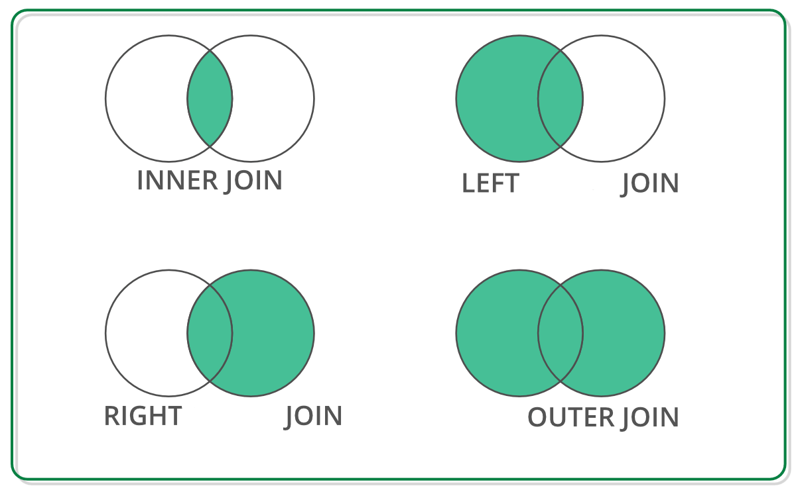
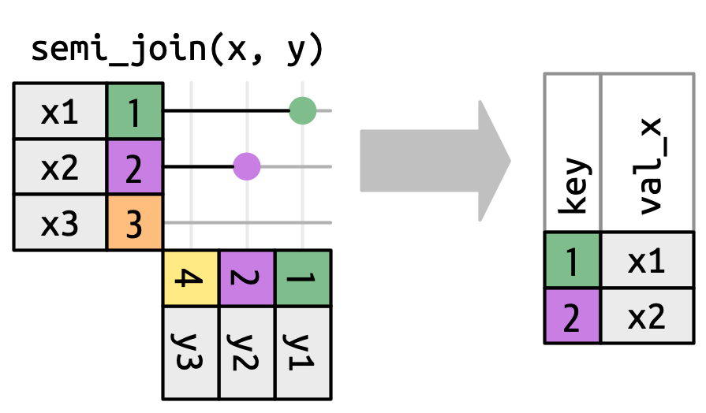
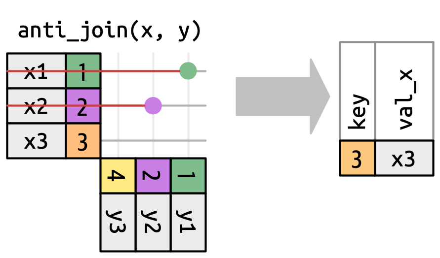

```{r}
#| include: false
#| eval: true

library(reticulate)
```

```{python}
#| include: false
#| eval: true

import numpy as np
import pandas as pd
from plotnine import *
```

# Plan for Today

::: {.midi}
1. What's ahead with Final Projects

2. Debrief on Lab 7
:::

::: {.small}
- Why clean a variable
- Categorical variables vs. one-hot encoded variables
- Model errors
- Coefficient interpretation
:::

[3. Discuss different types of joins]{.midi}

::: {.small}
- Keys
- The `merge()` function
- Joining on multiple keys
- Joining on keys with different names
- Different types of joins
:::

# Final Project

## Visualizations

::: {.midi}
Your final poster will contain **two** (not three, not four) visualizations. 

1. A visualization which addresses your primary research question. 
2. A visualization which addresses your secondary research question.
:::

. . .

::: {.midi}
- At least one plot must include 3+ variables.
- Both plots must use non-default colors.
- Both plots should follow the visualization "best practices" outlined in the
[project resources](https://docs.google.com/presentation/d/1ZIBJzHWQFJtsQzkak0W-Z5RxT-0wSrvGPckXxhs8M-c/edit?slide=id.p#slide=id.p).
:::

## Data Models

::: {.midi}
Fit a model(s) to the data to address your primary and secondary research
questions. You are expected to explicitly state the modeling choices you made
and the results of the model(s) you fit.

The following are *minimum* criteria for the model(s) you fit to your data:

- Include a model covered after the midterm exam (KNN, logistic regression, 
linear regression, decision tree, k-means).
- Use cross-validation to estimate the testing error of the model.
- Choose a "meaningful" model metric to summarize the fit of a model.
:::

# Lab 7 Debrief

## Cleaning Variables

What does a `Mode` of 0 represent? 

. . .

```{python}
#| eval: false
#| label: convert-mode-to-meaningful-values
#| code-line-numbers: false

df_songs['Mode'] = (
  df_songs['Mode']
  .replace({1: 'Major', 0: 'Minor'})
  )
```

How did I know that `0` represented a minor key?  

. . .

The [data documentation](https://developer.spotify.com/documentation/web-api/reference/get-audio-features)! 

## Obtaining Coefficients for **Every** Variable Level

::: {.midi}
Even if you converted `TimeSignature` and `Mode` into categorical / string 
variables, you **will not** get coefficient estimates for **every** level of 
these variables. 
:::

. . .

::: {.midi}
**Q**: What do you get?

**A**: Adjustments for each group relative to the "baseline" group.  
:::

. . .

::: {.midi}
**Q**: What group is the "baseline" group?

**A**: The group that comes first alphabetically (has the lowest ASCII representation).
:::

## Obtaining Coefficients for **Every** Variable Level

How do you get values for **every** level of a categorical variable?

. . .

One-hot Encoding! 

```{python}
#| eval: false
#| label: one-hot-encode
#| code-line-numbers: false

ct = make_column_transformer(
    (OneHotEncoder(handle_unknown = "ignore"),
     ["TimeSignature", "Mode"]
     ),
    remainder = "passthrough"
)
```

## Penalized Logistic Regression is the Default! 

```{python}
#| eval: false
#| code-line-numbers: "3"

pipeline = make_pipeline(
    ct,
  LogisticRegression(penalty = None)
  )
```

## Model Error versus Testing Error

::: columns
::: {.column width="48%"}
::: {.midi}
> What is the accuracy of this model?
:::

</br>

::: {.midi}
::: {.fragment}
***this model*** represents the errors of the model that was fit to the training
data, where we know the value of the target variable

::: {.fragment}
Cross-validation is not necessary here!
:::
:::
:::
:::

::: {.column width="5%"}
:::

::: {.column width="47%"}
::: {.midi}
> If you were to use this model to predict, what **precision** would you expect to get? 
:::

</br>

::: {.midi}
::: {.fragment}
***predicting*** involves "testing" data, where we don't know the value of the
target variable

::: {.fragment}
Cross-validation is necessary here!
:::
:::
:::
:::
:::

## Interpreting Coefficents

::: {.midi}
Each coefficient is associated with the change in the ***log-odds of a song 
containing explicit lyrics***. 
:::

. . .

::: {.small}
`TimeSignature_1`: `1.536751`

> A 1/4 time signature is associated with an increase of 1.53 in the log-odds of
> a song containing explicit lyrics. 

:::

</br> 

. . .

::: {.small}
`Speechiness`: `0.963213`

> An increase of speechiness by 1 standard devation above the mean 
> (making the song almost entirely made up of spoken words) is associated with
> an increase of 0.96 in the log-odds of a song containing explicit lyrics. 

:::

<!-- Speechiness detects the presence of spoken words in a track. The more exclusively speech-like the recording (e.g. talk show, audio book, poetry), the closer to 1.0 the attribute value. Values above 0.66 describe tracks that are probably made entirely of spoken words. Values between 0.33 and 0.66 describe tracks that may contain both music and speech, either in sections or layered, including such cases as rap music. Values below 0.33 most likely represent music and other non-speech-like tracks. -->

# Joining Datasets

## Example: Planes and Flights

Sometimes, information is spread across multiple data sets.

For example, suppose we want to know which manufacturer's planes made the most
flights in 2013.

## Example: Information on Flights

One data set contains information about flights from January to September 
2013...

::: {.midi}
```{python}
#| code-line-numbers: false
#| label: read-in-flights-data
#| eval: true

df_flights = pd.read_csv("data/flights.csv")
```

```{python}
#| echo: false
#| label: flights-head
#| eval: true

df_flights
```
:::

## Example: Information on Planes

...while another contains information about planes.

::: {.midi}
```{python}
#| code-line-numbers: false
#| label: read-in-plane-data
#| eval: true

df_planes = pd.read_csv("data/planes.csv")
```

```{python}
#| echo: false
#| label: planes-head
#| eval: true

df_planes
```
:::

## Example: Planes and Flights

> Which manufacturer's planes made the most flights in November 2013?

In order to answer this question we need to join these two data sets together!

# Joining on a Key

## Keys

::: {.incremental}
-   A **primary key** is a column (or a set of columns) that uniquely identifies observations in a data frame.

-   The **primary key** is the column(s) you would think of as the **index**.

-   A **foreign key** is a column (or a set of columns) that points to the
primary key of another data frame.

-   Planes are uniquely identified by their *tail number* (`tailnum`).
:::

## Key for Planes

What column (or set of columns) uniquely identifies an observation in this 
dataset?

::: {.midi}
```{python}
#| echo: false
#| label: planes-again
#| eval: true

df_planes
```
:::

## Key for Flights

What column (or set of columns) uniquely identifies an observation in this 
dataset?

::: {.midi}
```{python}
#| echo: false
#| label: flights-again
#| eval: true

df_flights
```
:::

## Joining on a Key

Each value of the **primary key** should only appear once, but it could appear
many times in a **foreign key**.

::: columns
::: {.column width="48%"}
```{python}
#| code-line-numbers: false
#| label: flights-tail-num
#| eval: true

(
  df_planes['tailnum']
  .value_counts()
)
```

:::

::: {.column width="3%"}
:::

::: {.column width="48%"}
```{python}
#| code-line-numbers: false
#| label: planes-tail-num
#| eval: true

(
  df_flights['tailnum']
  .value_counts()
)
```

:::
:::

## Joining on a Key

The Pandas function `.merge()` can be used to join two `DataFrame`s on a key.

::: {.midi}
```{python}
#| code-line-numbers: false
#| label: merge-planes-flights
#| eval: true

df_joined = df_flights.merge(df_planes, on = "tailnum")
```

```{python}
#| echo: false
#| label: merged-flights-head
#| eval: true

df_joined   
```
:::

## Overlapping Column Names

::: {.midi}
::: {.incremental}
-   Joining two data frames results in a *wider* data frame, with more columns.

-   By default, Pandas adds the suffixes `_x` and `_y` to overlapping column
names, but this can be customized.
:::
:::

. . .

::: {.midi}
```{python}
#| code-line-numbers: false
#| label: joined-data-column-names
#| eval: true

df_joined.columns
```
:::

## Overlapping Column Names

But this can be customized!

::: {.midi}
```{python}
#| code-line-numbers: "2"
#| label: customize-duplicate-columns
#| eval: true

df_joined = df_flights.merge(df_planes, on = "tailnum",
                             suffixes = ("_flight", "_plane")
                             )
```
:::

. . .

::: {.midi}
```{python}
#| echo: false
#| label: joined-data-column-names-customized
#| eval: true

df_joined.columns
```
:::

## Analyzing the Joined Data

> Which manufacturer's planes made the most flights in November 2013?

```{python}
#| code-line-numbers: false
#| label: manufacturer-counts-nov
#| eval: true

df_joined["manufacturer"].value_counts()
```

# Joining on Multiple Keys

## Example: Weather and Flights

> What weather factors are related to flight delays?

. . .

Here is a data set containing hourly weather data at each airport in 2013:

::: {.midi}
```{python}
#| code-line-numbers: false
#| code-fold: true
#| label: read-in-weather-data

df_weather = pd.read_csv("data/weather.csv")
```

```{python}
#| echo: false
#| label: weather-head
df_weather
```
:::

## Identifying the Primary Key

**What is / are the primary key(s) of this dataset?**

::: {.midi}
```{python}
#| echo: false
#| label: weather-head-2

(
  df_weather
  [["origin", "year", "month", "day",
  "hour", "wind_gust", "precip", "pressure",
  "visib"
  ]]
)
```
:::

## Verifying Primary Key

```{python}
#| code-line-numbers: false
#| label: verifying-unique-observations-weather

(
  df_weather
  .groupby(["origin", "year", "month", "day", "hour"])
  .size()
)
```

## A Key with Multiple Columns

We need to join to the weather data on the origin, year, month, day, and hour.

::: {.midi}
```{python}
#| code-line-numbers: false
#| label: join-flights-weather

df_flights_weather = df_flights.merge(df_weather, 
                                      on = ("origin", 
                                            "year", 
                                            "month", 
                                            "day", 
                                            "hour")
                              )
```

```{python}
#| echo: false
#| label: joined-weather-head

df_flights_weather
```
:::

## How does rain affect departure delays?

```{python}
#| code-fold: true
#| label: precip-delay-scatterplot-point-code
#| eval: false
#| code-line-numbers: false

from plotnine import *

(
  ggplot(data = df_flights_weather, 
         mapping = aes(x = "precip", y = "dep_delay", color = "origin")) +
  geom_point(alpha = 0.2) +
  labs(x = "Precipitation (feet)", 
       y = "Departure Delay (minutes)") +
  theme_bw()
)
```

```{python}
#| label: precip-delay-scatterplot-point
#| echo: false
#| fig-align: center

from plotnine import *

plot = (
  ggplot(data = df_flights_weather, 
         mapping = aes(x = "precip", y = "dep_delay", color = "origin")) +
  geom_point(alpha = 0.2) +
  labs(x = "Precipitation (feet)", 
       y = "Departure Delay (minutes)") +
  theme_bw()
)

plot.show()
```

Hmmmm....where did all the data go?

## How does rain affect departure delays?

```{python}
#| code-fold: true
#| label: precip-delay-scatterplot-jitter-code
#| eval: false
#| code-line-numbers: false

(
  ggplot(data = df_flights_weather, 
         mapping = aes(x = "precip", y = "dep_delay", color = "origin")) +
  geom_jitter(alpha = 0.2, width = 0.1) +
  labs(x = "Precipitation (feet)", 
       y = "Departure Delay (minutes)", 
       color = "New York City Airport") +
  theme_bw()
)
```

```{python}
#| label: precip-delay-scatterplot-jitter
#| echo: false
#| fig-align: center

plot = (
  ggplot(data = df_flights_weather, 
         mapping = aes(x = "precip", y = "dep_delay", color = "origin")) +
  geom_jitter(alpha = 0.2, width = 0.1) +
  labs(x = "Precipitation (feet)", 
       y = "Departure Delay (minutes)", 
       color = "New York City Airport") +
  theme_bw()
)

plot.show()
```

. . .

What changes would make this plot even better?

## Joining on Keys with Different Names

::: {.incremental}
::: {.midi}
-   Sometimes, the join keys have different names in the two data sets.

-   This frequently happens if the data sets come from different sources.

-   For example, suppose the airport was named `origin` in `df_flights` but
was named `airport` in `df_weather`. 

-   The `.merge()` function provides `left_on =` and `right_on =` arguments for
specifying different column names in the **left** (first) and **right** 
(second) data sets.
:::
:::

## Joining on Keys with Different Names

```{python}
#| code-line-numbers: "3-4"
#| label: joining-multiple-keys
#| eval: false

df_flights_weather = df_flights.merge(
    df_weather,
    left_on = ("origin", "year", "month", "day", "hour"),
    right_on = ("airport", "year", "month", "day", "hour")
    )
```

# Joins with Missing Keys

## Example: Baby names

::: {.midi}
The data below contains counts of names for babies born in 1920 and 2020:
:::

::: {.small}
```{python}
#| code-line-numbers: false
#| code-fold: true
#| label: read-in-baby-names

data_dir = "http://dlsun.github.io/pods/data/names/"

df_1920 = pd.read_csv(data_dir + "yob1920.txt", header = None,
                      names = ["Name", "Sex", "Count"]
                      )
df_2020 = pd.read_csv(data_dir + "yob2020.txt", header = None,
                      names = ["Name", "Sex", "Count"]
                      )
```
:::

::: {.midi}
::: columns
::: {.column width="48%"}

**1920** 

```{python}
#| echo: false
#| label: 1920-names

df_1920
```

:::

::: {.column width="3%"}
:::

::: {.column width="48%"}

**2020**

```{python}
#| echo: false
#| label: 2020-names

df_2020
```

:::
:::
:::

## Joins

We can merge these two data sets on a their primary keys...

```{python}
#| code-line-numbers: false
#| label: join-1920-2020-data

df_joined = (
  df_1920
  .merge(df_2020, 
         on = ["Name", "Sex"], 
         suffixes = ("_1920", "_2020")
         )
  )
```

```{python}
#| echo: false
#| label: join-1920-2020-data-head

df_joined
```

## What happened to some of the names?

```{python}
#| code-line-numbers: false
#| label: maya-missing

df_joined[df_joined["Name"] == "Maya"]
```

</br>

::: {.midi}
Why isn't Maya in the joined data? It's in the 2020 data...

```{python}
#| code-line-numbers: false
#| label: maya-2020

df_2020[df_2020["Name"] == "Maya"]
```
:::

## Missing Keys

::: {.midi}
...but Maya is not in the 1920 data.

```{python}
#| code-line-numbers: false
#| label: maya-1920

df_1920[df_1920["Name"] == "Maya"]
```
:::

. . .

</br>

What type of join did the `merge()` function make by default?

. . .

**An inner join!**


# Other Types of Joins

## Types of Joins

{fig-alt="A Venn diagram illustrating four types of joins using two overlapping circles in each diagram. The highlighted (green) areas represent the included data for each join type. Inner Join: Only the overlapping region of both circles is highlighted, representing the common data between the two tables. Left Join: The entire left circle, including its overlap with the right circle, is highlighted, representing all data from the left table and any matching data from the right table. Right Join: The entire right circle, including its overlap with the left circle, is highlighted, representing all data from the right table and any matching data from the left table. Outer Join: Both entire circles are highlighted, representing all data from both tables, including matches and non-matches."}
<!-- ::: {.midi} -->
<!-- ::: {.incremental} -->
<!-- -   By default, Pandas does an ***inner join***, which only keeps keys that are -->
<!-- present in *both* tables. -->

<!-- -   An ***outer join*** keeps any key that is present in either table. -->

<!-- -   A ***left join*** keeps all keys in the left table, even if they are not in -->
<!-- the right table. But any keys that are only in the right table are dropped. -->

<!-- -   A ***right join*** keeps all keys in the right table, even if they are not -->
<!-- in the left table. But any keys that are only in the left table are dropped. -->
<!-- ::: -->
<!-- ::: -->

## Types of Joins

::: {.midi}
We can customize the type of join using the `how =` parameter of `.merge()`. 
By default, `how = "inner"`.

```{python}
#| code-line-numbers: false
#| label: join-outer
df_joined_outer = (
  df_1920
  .merge(df_2020, 
         on = ["Name", "Sex"],
         suffixes = ("_1920", "_2020"), 
         how = "outer")
    )
```
:::

. . .

</br>

::: {.midi}
```{python}
#| code-line-numbers: false
#| label: maya-outer-join

df_joined_outer[df_joined_outer["Name"] == "Maya"]
```
:::

## Types of Joins

::: {.midi}
-   Note the missing values for other columns, like `Count_1920`!

-   What other type of join would have produced this output in the Maya row?
:::

## Types of Joins

::: {.midi}
-   Note the missing values for other columns, like `Count_1920`!

-   What other type of join would have produced this output in the Maya row?

```{python}
#| code-line-numbers: false
#| label: right-join-instead-of-outer

df_joined_right = (
  df_1920
  .merge(df_2020, 
         on = ["Name", "Sex"],
         suffixes = ("_1920", "_2020"), 
         how = "right")
    )
```

</br>

```{python}
#| code-line-numbers: false
#| label: right-join-preview

df_joined_right[df_joined_right["Name"] == "Maya"]
```
:::

## Quick Quiz

Which type of join would be best suited for each case?

1.  We want to determine the names that have increased in popularity the most
between 1920 and 2020.

<!-- Left join -- we want to keep all the names in 1920 but only add names that still exist in 2020. -->

2.  We want to graph the popularity of names over time.

<!-- Inner join -- we can only plot names in both data sets! -->

3.  We want to know what names from 1920 are no longer in use in 2020.

<!-- Filtering join -- an anti join! -->

# Filtering Joins

## Filtering Joins
Inner, outer, left, and right are known as **mutating joins**, because they
create new combined data sets.

</br>

There are two other types of joins that we use for **filtering**---to remove 
certain rows from the data. 

## Filtering Joins

::: columns
::: {.column width="47%"}
{fig-alt="A diagram illustrating the concept of a semi-join. On the left, two tables are shown: The first table (x) has two columns, with labeled values (x1, x2, x3) in the first column and numerical values (1, 2, 3) in the second column. The second table (y) has two columns, where the second column contains numerical values (4, 2, 1), and the first column has values (y3, y2, y1). Lines connect matching values between the two tables: 1 from x is found in y, as is 2, but 3 is not present in y. The result of the semi-join is shown in a table on the right, containing only the rows from x where a match was found in y. The output table has two columns: key and val_x, and it retains only the rows with keys 1 and 2 from x (x1 and x2), omitting x3 since 3 is not present in y."}

</br>

A **semi-join** tells us which keys in the *left dataset* 
[**are also**]{.underline} present in the *right dataset*.
:::

::: {.column width="3%"}
:::

::: {.column width="48%"}
::: {.fragment}
{fig-alt="A diagram illustrating the concept of an anti-join (anti_join(x, y)). On the left, two tables are shown: The first table (x) has two columns, with labeled values (x1, x2, x3) in the first column and numerical values (1, 2, 3) in the second column. The second table (y) has two columns, where the second column contains numerical values (4, 2, 1), and the first column has values (y3, y2, y1). Lines connect matching values between the two tables: 1 from x is found in y, as is 2, but 3 is not present in y. Red lines indicate rows that have matches, which are excluded in the anti-join. The result of the anti-join is shown in a table on the right, containing only the row from x where no match was found in y. The output table has two columns: key and val_x, and it retains only the row with key 3 from x (x3), omitting x1 and x2 since they had matches in y."}

</br>

An **anti-join** tells us which keys in the *left dataset* 
[**are not**]{.underline} present in the *right dataset*.

:::
:::
:::

## Filtering Joins

> Which names existed in 1920 but don't in 2020?

. . .

In Pandas, we can't do these using `.merge()`, but we can use the `isin()`
function!

```{python}
#| code-line-numbers: false
#| label: semi-join-names

in_both = df_1920['Name'].isin(df_2020['Name'])
df_1920.loc[~in_both, 'Name']
```

# Takeaways

## Takeaways

::: {.midi}
-   A **primary key** is one or more columns that uniquely identify the rows.

-   We can **join** (a.k.a. **merge**) data sets if they share a primary key, or if one has a **foreign key**.

-   The default of `.merge()` is an *inner join*: only keys in both data sets are kept.

-   We can instead specify a *left join*, *right join*, or *outer join*; think about which rows we want to keep.

-   **Filtering joins** like *anti-join* and *semi-join* can help you answer questions about the data.

-   Use `.isin()` to see which keys in one dataset exist in the other.
:::


