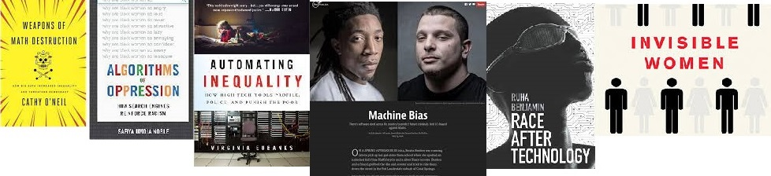
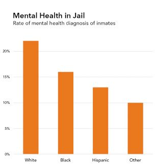
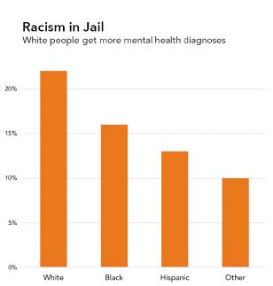
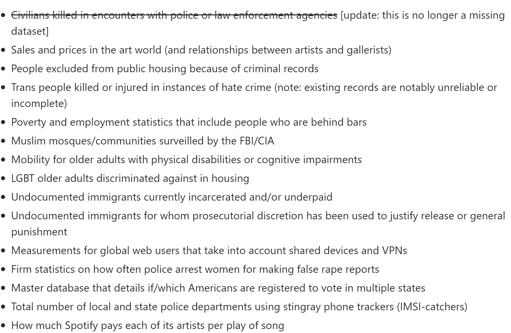

## Over the last 8 weeks...

{.absolute width=216.469px height=253.119px left=0px top=89px}
{.absolute width=303.017px height=194.169px left=130.593px top=285.256px}

{.absolute width=307.154px height=231.665px left=353.847px top=84.0358px}

{.absolute width=360.373px height=257.766px left=668.627px top=74px}

{.absolute width=279.38px height=197.299px left=-112.919px top=500.591px}
{.absolute width=475.19px height=322.416px left=513.81px top=369.584px}

# Discussion Norms

- Zero tolerance for: racism, sexism, homophobia, transphobia, ageism, ableism

- Do not make generalizations -- Use "I" statements

- Respect one another

- Intent and impact *both* matter

- Non-judgmental

- Embrace discomfort

## Data Feminism

{fig-alt="A picture of the outline of Beyonce standing on stage in front of a projection that says 'FEMINIST'." width=90%}

. . .

Focuses beyond women and gender.

Focuses on the distribution of **power**. 

# Data is Power

## "Data is the new oil."

> The Economist, Intel CEO, Reliance Industrices CEO, UAE Minister of Artifical
> Intelligence, Google execs, etc.

. . .

[**"Data is the same old oppression."**]{style="font-size: 1.5em; color: #0F4C81;"}

> BIPOC, Indigenous people, immigrant communities, LGBTQ+ individuals, white
women + more

{fig-alt="A compilation of the front covers of various books all written about data as a tool of oppression, Weapons of Math Destruction by Cathy O'Neil, Algorithms of Oppression by Safiya Noble, Automating Inequality by Virginia Eubanks, Machine Bias by ProPublica, Race After Technology by Ruha Benjamin, and Invisible Women by Caroline Criado-Perez."}

## Data Neutrality

> Data are not neutral or objective. They are the products of unequal social
> relations, and this context is essential for conducting accurate, ethical
> analysis.

::: {.centered}
{"A screenshot of the 'Data and Documentation' page for the Youth Risk Behavior and Surveillance System (YRBSS) arm of the CDC. The top of the website has a yellow banner which says, 'Per a court order, HHS is required to restore this website as of 11:59PM ET, February 11, 2025. Any information on this page promoting gender ideology is extremely inaccurate and disconnected from the immutable biological reality that there are two sexes, male and female. The Trump Administration rejects gender ideology and condemns the harms it causes to children, by promoting their chemical and surgical mutilation, and to women, by depriving them of their dignity, safety, well-being, and opportunities. This page does not reflect biological reality and therefore the Administration and this Department rejects it.' This banner appeared shortly after President Trump was elected as a diclaimer for the data related to gender that the YRBSS survey studies."}
:::

# Discussion Questions

# Which actors in the data ecosystem are responsible for providing context?

End users? Data publishers? Data intermediaries?

# What steps can we take to ensure context is considered?

How can we more effectively present context through data visualization?

# What are your thoughts on how we label graphs with context?

## Elevating Emotion

::: {.small}
> "We focus on four conventions which imbue visualizations with a sense of
> objectivity, transparency and facticity. These include: (a) two-dimensional
> viewpoints, (b) clean layouts, (c) geometric shapes and lines, (d) the
> inclusion of data sources."
>
> Kennedy et al. (2016)
:::

::: columns
::: {.column width="50%"}
{fig-alt="A barplot of the number of mental health diagnoses that people in prison receive. The barplot is in decreasing order, with White people receiving the largest number of diagnoses (23%), followed by Black people (16%), followed by Hispanic people (13%), and then a group labeled Other. The title of the plot says 'Mental Health in Jail' with a subtitle that reads 'Rate of mental health diagnosis of inmates.'"}
:::

::: {.column width="50%"}
{fig-alt="The same barplot as previously, but the title of the plot has been changed to say 'Racism in Jail' with a subtitle that reads 'White people get more mental health diagnoses.'"}
:::
:::

# Which power imbalances have led to silences in the dataset or data that are missing altogether?

## Library of Missing Data

::: columns
::: {.column width="40%"}
{fig-alt="A picture of a person's hands as they go through a file cabinet with file folders with different labels. The hands are Mimi Onuoha's the artist that created the art exhibit."}
:::

::: {.column width="5%"}
:::

::: {.column width="55%"}
{fig-alt="A list of some of the datasets that have never been collected. The list is part of the file cabinet shown above. The first dataset: Civilians killed in encounters with police or law enforcement agencies, has a line through it and an update that this is no longer a missing dataset. The remainder of the datasets listed are still missing. Here is the list: Sales and prices in the art world (and relationships between artists and gallerists), People excluded from public housing because of criminal records, Trans people killed or injured in instances of hate crime (note: existing records are notably unreliable or incomplete), Poverty and employment statistics that include people who are behind bars, Muslim mosques/communities surveilled by the FBI/CIA, Mobility for older adults with physical disabilities or cognitive impairments, LGBT older adults discriminated against in housing, Undocumented immigrants currently incarcerated and/or underpaid, Undocumented immigrants for whom prosecutorial discretion has been used to justify release or general punishment, Measurements for global web users that take into account shared devices and VPNs, Firm statistics on how often police arrest women for making false rape reports, Master database that details if/which Americans are registered to vote in multiple states, Total number of local and state police departments using stingray phone trackers (IMSI-catchers), How much Spotify pays each of its artists per play of song."}
:::
:::

::: {.small}
> "When you look into them, you start to realize that they almost universally
> intersect with the interests of the most vulnerable."
>
> Mimi Onuoha
:::

# Project Application

## Data Context

In the "Data Context" section of your Final Poster, you are required to
provide a description that directly addresses the: 

- social,
- cultural,
- historical,
- institutional, and
- material conditions under which the data were produced.

## Example: Ames, Iowa Housing Data

::: {.small}
- What are the social conditions of these data?
  * What are the social influences of owning a house?
:::

. . .

::: {.small}
- What are the cultural conditions of these data?
  * What is the culture surrounding home ownership in the United States?
  * Does owning a house look the same for everyone?
:::

. . .

::: {.small}
- What are the historical conditions of these data?
  * What is the history associated with home ownership in the US?
  * What is the history associated with home ownership in Ames, Iowa?
:::

. . .

::: {.small}
- What are the institutional conditions of these data?
  * What are the institutional forces that factor into home ownership?
:::

. . .

::: {.small}
- What are the material conditions of these data?
  * How were the data collected?
  * What houses / neighborhoods / individuals are represented in these data? 
  Excluded from these data?
:::

# Next Week

## Exam 2 on Thursday

The practice final is posted on Canvas 
([and the course website](../exam-materials/practice-final.qmd)).

We will discuss the practice final during class on Tuesday! 
